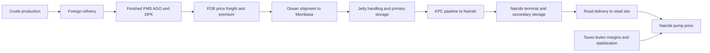
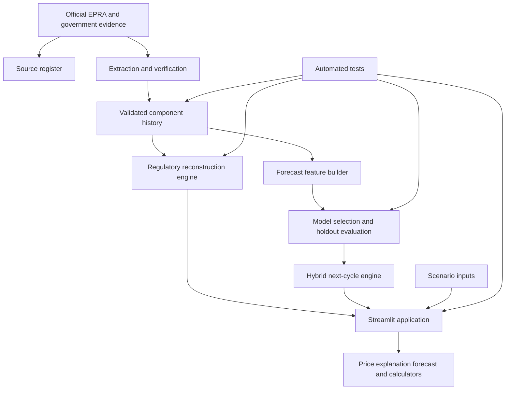

# MafutaPlan Hybrid Project Implementation Blueprint

## Document status

- Project level: Bachelor of Science in Information Technology final project
- Student: Ryan Alfred Nyambati
- Registration number: SCT222-0195/2021
- Institution: Jomo Kenyatta University of Agriculture and Technology
- Primary market: Nairobi, Kenya
- Working status: controlling redesign and implementation plan
- Last revised: 22 July 2026

This file is the controlling blueprint for the source code, data collection, model, notebook, tests, application, report, presentation, and defence. Any later implementation decision that conflicts with this document must be recorded in the decision log before the affected artifact is changed.

## 1. Final recommendation

The project will be implemented as a **hybrid cost-based forecasting and decision-support system**.

It will not claim that historical pump prices alone explain the next EPRA price. It will represent the official petroleum cost chain, reconstruct published Nairobi pump prices from official components, forecast the genuinely uncertain next-cycle components, and compare the resulting estimate with simple statistical baselines.

### Recommended final title

> Design and Implementation of a Hybrid Cost-Based Model for Forecasting Regulated Fuel Prices in Nairobi, Kenya

### Short product name

> MafutaPlan

### One-sentence supervisor proposal

> MafutaPlan will model Nairobi's maximum retail fuel price using official EPRA landed cost, Mombasa-to-Nairobi distribution, margins, stabilization, taxes and levies; uncertain next-cycle components will be forecast using time-ordered regression, while known components will be applied through the official pricing formula and evaluated against a previous-price baseline.

## 2. Why this is the strongest degree-project route

This approach gives the project five examinable contributions:

1. **A real Kenyan problem:** Nairobi residents and transport operators need transparent fuel-price and cost-planning information.
2. **A verified data contribution:** monthly EPRA price and cost-component records with source and revision metadata.
3. **A clear computational contribution:** an implementation of the regulated price build-up.
4. **A valid predictive contribution:** a next-cycle hybrid forecast using only information available at the forecast origin.
5. **A complete IT system:** data ingestion, validation, modelling, application interface, testing, documentation, and user guidance.

The project remains achievable because it focuses on one town and three products, avoids unnecessary user accounts or payments, and uses interpretable models suitable for a small monthly dataset.

No document should state that the project guarantees future prices, replaces EPRA, or guarantees an academic award.

## 3. Correct domain interpretation

### 3.1 Kenya's supply chain

Kenya has imported ordinary pump fuels mainly in refined form since the Mombasa refinery stopped processing crude in 2013. The physical and commercial chain is therefore:



The international crude price is an upstream market indicator. The more direct Kenyan cost is the landed cost of imported refined PMS, AGO, or DPK.

### 3.2 Meaning of landed cost

Landed cost is not the cost of delivering fuel to each Nairobi station. It is the weighted imported-product cost through a gazetted primary storage depot. The later cost of reaching Nairobi is represented through pipeline or road bridging, losses, secondary storage, and final delivery to the retail site.

### 3.3 Official regulatory structure

The implementation will use the Petroleum (Pricing) Regulations and EPRA's published formula. At a user-readable level:

```text
Nairobi retail price
  = landed product cost
  + storage and distribution
  + importer and dealer margins
  + stabilization/subsidy adjustment
  + taxes and levies
  + rounding reconciliation where required
```

The detailed engine will retain the individual regulatory components and will not double-count VAT or any subtotal.

## 4. Problem statement

Official EPRA announcements provide Nairobi maximum retail prices but ordinary users may not understand how imported-product cost, transport from Mombasa, storage, losses, margins, stabilization, taxes, and levies create the final pump price. A price-history-only forecast also fails to represent these economic and regulatory drivers. There is therefore a need for a source-verifiable system that reconstructs the official price build-up, produces a leakage-safe next-cycle estimate, explains uncertainty, and translates prices into practical purchase and journey costs.

## 5. Aim and objectives

### 5.1 Main objective

To design, implement, and evaluate a hybrid cost-based system for reconstructing, forecasting, and applying regulated Nairobi fuel prices using verified official data.

### 5.2 Specific objectives

1. Compile a source-verified monthly dataset of Nairobi pump prices and official price components for Super Petrol, Diesel, and Kerosene.
2. Implement and test the official regulated pump-price build-up for Nairobi.
3. Develop a leakage-safe model for forecasting uncertain next-cycle cost components.
4. Combine forecasted and known components to estimate the next Nairobi maximum retail price.
5. Compare the hybrid forecast with previous-price and price-lag regression baselines using time-ordered evaluation.
6. Implement a web decision-support system for price build-up, forecasting, scenarios, purchase-cost calculation, and journey planning.
7. Evaluate data integrity, model accuracy, system functionality, usability, limitations, and reproducibility.

## 6. Research questions

1. What official cost components make up Nairobi's maximum retail fuel prices?
2. Which components account for the largest changes across pricing cycles and fuels?
3. Can cost-informed, past-available variables improve next-cycle forecasts over a previous-price baseline?
4. How accurately can the system reconstruct an already published EPRA Nairobi price?
5. How accurately can the hybrid model estimate an unseen future price cycle?
6. Can the resulting interface support fuel-purchase and journey-cost planning without confusing official facts with experimental estimates?

## 7. Research hypotheses

The statistical report may test these hypotheses if the final component dataset has sufficient coverage:

- **H0:** The hybrid cost-informed model does not reduce next-cycle MAE relative to the previous-price baseline.
- **H1:** The hybrid cost-informed model reduces next-cycle MAE relative to the previous-price baseline.

The conclusion will follow the test evidence. The report will not claim H1 merely because the hybrid design is conceptually richer.

## 8. Users and stakeholders

### Primary users

- Private Nairobi motorists
- Taxi and ride-hailing drivers
- Matatu and bus operators
- Courier, delivery, and logistics businesses
- Small businesses operating vehicles or generators
- Households planning kerosene or transport expenditure

### Academic and institutional stakeholders

- Student and project supervisor
- Project assessment panel
- Researchers and students studying petroleum pricing
- Transport and consumer-policy analysts

### Regulatory role

EPRA is the authoritative data publisher and regulator. It is not described as a project client unless the Authority formally commissions the system.

## 9. System boundary

### Included

- Nairobi only
- PMS, AGO, and DPK
- Official maximum retail prices
- Official historical cost components
- Price revisions and actual effective dates
- Deterministic regulatory reconstruction
- Experimental next-cycle forecasts
- Scenario analysis
- Purchase, budget, and journey calculators
- Source register, methodology, and limitations

### Excluded

- Live station-level selling prices
- Other Kenyan towns in the primary implementation
- User accounts, payments, or fuel purchases
- Route navigation or GPS tracking
- Commercial trading recommendations
- Claims that the forecast is an EPRA announcement
- A direct prediction of refinery output from crude chemistry

## 10. Source hierarchy

Sources will be ranked as follows:

1. EPRA pricing regulations, monthly press releases, Annex cost tables, price database, and official notices
2. State Department for Petroleum import and infrastructure publications
3. Kenya Pipeline Company official tariffs and service documents
4. Kenya Revenue Authority tax publications
5. Central Bank of Kenya exchange-rate data
6. Kenya National Bureau of Statistics contextual cross-checks
7. International public primary sources for crude or product-market context

Third-party fuel-price websites will not control any recorded value.

### Core official references

- EPRA pump-price formula: https://www.epra.go.ke/index.php/pump-price-formulae
- Petroleum Pricing Regulations: https://petroleum.go.ke/sites/default/files/The%20Petroleum%20%28Pricing%29%20Regulations.pdf
- EPRA pump-price database: https://www.epra.go.ke/pump-prices
- State Department petroleum information: https://www.petroleum.go.ke/petroleum-information
- KPC transport and storage information: https://qmseldoret.kpc.co.ke/downloads/SERVICE_DELIVERY_CHARTER.pdf

## 11. Required datasets

### 11.1 Retail-price history

File: `data/nairobi_price_history.csv`

Grain: one row per pricing cycle.

Status: 55 continuous cycles from January 2022 to July 2026 already recorded.

Required columns:

```text
Cycle
Effective_From
Effective_To
Super_Petrol
Diesel
Kerosene
Source_ID
```

### 11.2 Long-form cost-component history

Proposed file: `data/nairobi_component_history.csv`

Grain: one row per cycle, fuel, and component.

Required columns:

```text
Cycle
Effective_From
Effective_To
Town
Fuel
Component_Code
Component_Name
Component_Group
KES_Per_Litre
Known_Date
Source_ID
Revision_Status
Extraction_Method
Verification_Status
Notes
```

Allowed component groups:

```text
Product
Distribution
Margins
Stabilization
Taxes_Levies
Rounding
```

### 11.3 Wide modelling table

Proposed file: `data/nairobi_model_panel.csv`

Grain: one row per cycle and fuel.

Required fields:

```text
Cycle
Fuel
Landed_Cost
Storage_Distribution
Margins
Stabilization
Taxes_Levies
Retail_Price
Previous_Retail_Price
Previous_Landed_Cost
Previous_Stabilization
Month_Sin
Month_Cos
Known_Date
Source_ID
```

Optional fields may be added only if an authoritative historical series is available:

```text
FX_KES_USD
Refined_Product_Benchmark
Crude_Benchmark
Freight_Premium
```

Optional variables must never be fabricated or silently interpolated.

### 11.4 Detailed import-cost table

If the official source permits sufficient extraction, retain:

```text
FOB
Freight_Premium
Letter_of_Credit
Insurance_War_Risk
Conversion_Factor
FX_Rate
Certificate_of_Conformity
KPA_Handling
Stevedoring
Ocean_Loss
Administration
Inspection
Analysis_Recertification
Demurrage
```

These may be documented in the formula even when monthly public values are unavailable. Unavailable fields will not be populated with assumptions in the authoritative dataset.

## 12. Data-collection target

### Minimum

- 36 monthly pricing cycles
- Three fuels per cycle
- Approximately 108 cycle-fuel records

### Preferred

- January 2022 to the latest final cycle
- 55 or more cycles
- Approximately 165 cycle-fuel records

### Data-collection procedure

1. Locate the official EPRA press release for each cycle.
2. Save the publication URL and local evidence copy where permitted.
3. Extract the Nairobi Annex cost table.
4. Record each detailed component without changing its sign.
5. Record subtotals and final retail price separately.
6. Add a `Known_Date` corresponding to first official publication.
7. Preserve original and revised announcements as separate revision records.
8. Reconcile detailed components to the EPRA published total within KES 0.01/L.
9. Have a second manual verification pass for every extracted cycle.
10. Run automated data tests before including the cycle in modelling.

## 13. Data-quality rules

### Critical rules

- The town must be Nairobi.
- The cycle-fuel-component key must be unique.
- All source identifiers must resolve to the source register.
- Every source URL must use HTTPS.
- Effective end must not precede effective start.
- The detailed component sum must reconcile with the official retail total within KES 0.01/L.
- Negative stabilization must remain negative rather than being converted to zero.
- Revised announcements must not overwrite the original evidence.
- The final modelling target must use the final prevailing price and actual effective dates.

### Forecast-time rules

- Every model feature must have `Known_Date <= Forecast_Origin`.
- Same-cycle Annex components published with the target cannot predict that same target.
- Any external monthly average that includes days after the forecast origin is prohibited.
- Missing official values must remain missing or cause exclusion; they cannot be filled with invented numbers.

### Automated tests

- Required columns
- Data types
- Unique grain
- Allowed town, fuel, group, and status values
- Date ordering
- Positive ordinary costs
- Signed stabilization validity
- Source referential integrity
- Component-to-subtotal reconciliation
- Subtotal-to-retail reconciliation
- Consecutive-cycle coverage
- Revision audit coverage
- Known-date leakage checks
- Train-selection-holdout separation

## 14. Modelling design

### 14.1 Module A: regulatory reconstruction

Purpose: reproduce an already published Nairobi price from its components.

```text
Reconstructed_Retail
  = Landed_Cost
  + Storage_Distribution
  + Margins
  + Stabilization
  + Taxes_Levies
  + Rounding
```

Acceptance criterion: absolute reconstruction error no greater than KES 0.01/L for every verified cycle-fuel row.

This module demonstrates formula correctness. It is not presented as a forecast.

### 14.2 Module B: next-cycle component forecast

Purpose: estimate the parts of the next cycle that are unknown at the forecast origin.

Primary uncertain components:

- Landed cost
- Stabilization or subsidy adjustment

Known or policy-controlled components will be carried from the latest gazetted or officially published values until a change is known:

- Pipeline and storage tariffs
- Loss allowances
- Wholesale and retail margins
- Fixed taxes and levies

### 14.3 Candidate models

1. Previous retail price baseline
2. Previous component baseline
3. Ordinary linear regression
4. Ridge regression
5. Random forest with conservative depth and leaf sizes
6. Gradient boosting with conservative configuration
7. Hybrid component forecast plus regulatory formula

Ridge regression is the preferred interpretable fitted model before evaluation because the sample is small and predictors may be correlated. The final winner will be determined by out-of-sample error.

### 14.4 Possible landed-cost equation

```text
LandedCost[t+1]
  = beta0
  + beta1 * LandedCost[t]
  + beta2 * RetailPrice[t]
  + beta3 * FX_known_at_origin[t]
  + beta4 * MarketBenchmark_known_at_origin[t]
  + beta5 * MonthSin[t+1]
  + beta6 * MonthCos[t+1]
  + error
```

Unavailable optional predictors will be omitted, not assumed.

### 14.5 Final hybrid estimate

```text
Forecast_Retail[t+1]
  = Forecast_Landed_Cost[t+1]
  + Known_Distribution[t+1]
  + Known_Margins[t+1]
  + Forecast_or_Scenario_Stabilization[t+1]
  + Known_Taxes_Levies[t+1]
```

### 14.6 Stabilization treatment

Because stabilization can be a policy decision, the system will show:

- Central scenario: model or previous observed adjustment
- No-stabilization scenario: zero adjustment
- Observed historical range scenario

The point forecast must state which assumption controls it.

## 15. Evaluation protocol

### Time ordering

Random train-test splitting is prohibited.

The preferred sequence is:

```text
Initial historical training window
    -> expanding-window model selection
    -> fixed candidate selection
    -> final untouched 10-12 cycle holdout
    -> refit on all eligible history
    -> next-cycle estimate
```

When pooling fuels into a panel, all three products from the same cycle must remain in the same split to prevent time leakage.

### Metrics

- MAE in KES/L
- RMSE in KES/L
- Baseline MAE
- Error by fuel
- Reconstruction error
- Empirical interval coverage
- Direction accuracy as secondary evidence

R-squared may be reported as supplementary information but will not control model selection.

### Required comparisons

- Hybrid versus previous-price baseline
- Hybrid versus existing price-lag ridge regression
- Per-fuel and combined performance
- Performance before and after major revisions or policy changes

## 16. System architecture



### Proposed source modules

```text
src/paths.py
src/data.py
src/component_schema.py
src/reconstruction.py
src/features.py
src/modeling.py
src/scenarios.py
src/calculators.py
src/presentation.py
```

## 17. Application workflows

### Page 1: Current Nairobi prices

- Current official maximum prices
- Effective dates
- Official source
- Product cards
- Clear regulatory-cap wording

### Page 2: Price journey and build-up

- Crude-to-refined explanatory flow
- Imported refined-product clarification
- Mombasa-to-Nairobi distribution flow
- Cost waterfall
- Detailed component table
- Reconstruction check

### Page 3: Next-cycle forecast

- Fuel selection
- Forecast origin and target cycle
- Point forecast
- Empirical range
- Hybrid component contributions
- Baseline comparison
- Selected model and holdout error
- Policy and stabilization warning

### Page 4: Scenario simulator

- Official latest component values as defaults
- Clearly marked user-controlled changes
- Landed-cost percentage change
- Distribution change
- Tax and levy change
- Stabilization adjustment
- Recalculated scenario price
- Comparison with official price

Scenario results must never be stored as official data.

### Page 5: Fuel cost planner

- Cost for litres
- Litres for a budget
- Journey fuel and cost
- Current official or selected scenario price
- Complete-distance guidance

### Page 6: Evidence and methodology

- Source register
- Data coverage
- Revision audit
- Model features
- Selection and holdout design
- Metrics
- Limitations
- Downloadable verified extracts

## 18. User-interface principles

- Maintain the MafutaPlan Nairobi visual identity.
- Use plain language before technical terminology.
- Distinguish official, reconstructed, forecast, and scenario values through colour and labels.
- Always display KES/L units.
- Always display effective or target dates.
- Do not show an unexplained point forecast.
- Present source links near the data they support.
- Provide mobile-friendly layouts.
- Keep default scenarios realistic but explicitly non-official.

## 19. Security, ethics, and responsible computing

- Collect no personal user data.
- Use no credentials or private APIs in the repository.
- Preserve attribution for data, code libraries, and methodological sources.
- Do not fabricate cost values or citations.
- Do not present AI-generated text as personally verified without student review.
- Keep an originality and citation review before submission.
- Explain that the forecast cannot replace official EPRA communication.

## 20. Testing strategy

### Unit tests

- Component grouping
- Signed stabilization
- Price reconstruction
- Scenario calculations
- Forecast feature dates
- Calculator formulas

### Data tests

- Grain and uniqueness
- Completeness and valid categories
- Source keys and HTTPS URLs
- Reconciliation tolerance
- Effective-period validity
- Revision handling

### Model tests

- No future-dated features
- Deterministic output
- Separate model-selection and final holdout periods
- Baseline included
- Finite forecasts and error metrics
- Same-cycle grouping in panel splits

### Application tests

- Every navigation route renders
- Every calculator mode works
- Scenario controls update results
- Official and forecast labels remain distinct
- Source links are present
- Mobile and desktop layouts are usable

## 21. Notebook plan

The reproducible notebook will contain:

1. Scope and source statement
2. Data loading and schema validation
3. Coverage and missingness profile
4. Duplicate and grain checks
5. Component reconciliation
6. Historical component trends
7. Price-composition charts
8. Feature availability audit
9. Time-based split construction
10. Baseline evaluation
11. Regression and hybrid evaluation
12. Residual analysis
13. Per-fuel results
14. Final forecast and scenarios
15. Limitations and reproducibility notes

The notebook must execute from top to bottom without hidden state.

## 22. Report redesign

### Chapter One: Introduction

- Kenyan fuel-price context
- Refined-product import chain
- Problem statement
- Aim and objectives
- Questions and hypotheses
- Nairobi justification
- Scope, limitations, and significance

### Chapter Two: Literature Review

- Crude-to-refined-product process
- Kenyan import framework
- Petroleum Pricing Regulations
- Landed cost
- Distribution and retail costs
- Taxes, stabilization, and policy interventions
- Fuel-price forecasting methods
- Baselines, regression, and regularization
- Time-series leakage and validation
- Research gap and conceptual framework

### Chapter Three: Methodology and Design

- Applied quantitative design
- Source hierarchy
- Data extraction and verification
- Component schema
- Reconstruction formula
- Forecast origin and feature availability
- Model candidates
- Time-ordered evaluation
- Requirements and architecture
- Ethical and integrity controls

### Chapter Four: Implementation and Results

- Module implementation
- Data-quality results
- Reconstruction accuracy
- Exploratory analysis
- Model-selection results
- Holdout results
- Scenario examples
- Application workflows
- Test results
- Discussion

### Chapter Five: Conclusions and Recommendations

- Objective achievement
- Research-question answers
- Conclusion on hybrid versus baseline
- Practical recommendations
- Limitations
- Future work

### Appendices

- Data dictionary
- Source register
- Sample component data
- Model metrics
- Test cases
- User guide
- Schedule and budget
- Supervisor decision log
- Repository structure

## 23. Defence preparation

### Required five-minute demonstration

1. Show the current official Nairobi price and evidence link.
2. Open one historical build-up and show that components reconcile.
3. Explain the Mombasa-to-Nairobi cost chain.
4. Show the next-cycle estimate and identify forecasted versus known components.
5. Compare the hybrid result with the previous-price baseline.
6. Change one scenario input and show the effect.
7. Finish with limitations and the statement that EPRA remains authoritative.

### Questions the student must answer independently

- Why Nairobi?
- Why does the local chain begin with imported refined product?
- What is the difference between FOB, landed cost, and retail price?
- How does fuel reach Nairobi from Mombasa?
- Why is reconstruction not regression?
- Which variables are genuinely available before prediction?
- What is data leakage and how was it prevented?
- Why use ridge regression?
- Why include a simple baseline?
- How are taxes, revisions, and stabilization handled?
- Why is the model not guaranteed to predict policy decisions?

## 24. Current project assessment

### Reusable strengths

- Nairobi-only scope
- 55-cycle retail-price history
- Current official price record
- Source register
- Revision audit
- Existing component schema
- Time-ordered model-selection and holdout code
- Purchase and journey calculators
- Streamlit application structure
- Automated test foundation
- Five-chapter report builder

### Critical gaps

- Only one component cycle is currently stored.
- The active forecast uses price lags rather than the full cost chain.
- The winning current method is persistence, not a cost-based regression.
- No multi-cycle component reconstruction test exists.
- No explicit forecast-origin/known-date table exists.
- The report and notebook will become outdated when the hybrid model replaces the current forecast.

### Data-quality severity

| Finding | Severity | Effect | Required response |
|---|---|---|---|
| One component cycle only | Critical | Cannot train or compare a component-based model | Build multi-cycle official component history |
| Same-cycle components would equal target | Critical | Direct target leakage if used as predictors | Forecast components or use lagged/known-before-origin values |
| Stabilization may be policy-driven | High | Large unexpected forecast errors | Model separately and expose scenarios |
| Optional market inputs may be unavailable | High | Temptation to invent or backfill values | Omit or mark unavailable unless sourced |
| Small monthly sample | High | Overfitting risk | Group features, regularize, preserve baseline, use time splits |
| EPRA revisions | Medium | Target and effective-date ambiguity | Preserve original and final records |

## 25. Implementation phases and acceptance gates

### Phase 1: supervisor and blueprint alignment

Deliverables:

- This implementation blueprint
- Final title
- One-sentence proposal
- Objectives and research questions
- Forecast timing definition

Gate:

- Supervisor accepts the hybrid distinction between reconstruction and next-cycle forecasting.

### Phase 2: official component dataset

Deliverables:

- Multi-cycle long-form component history
- Wide modelling panel
- Expanded source register
- Extraction log
- Data-quality test suite

Gate:

- At least 36 verified cycles or an explicitly approved reduced study period
- Every included cycle reconciles within KES 0.01/L
- No unknown source identifiers

### Phase 3: reconstruction engine

Deliverables:

- Regulatory component-grouping code
- Detailed and grouped build-up output
- Reconciliation diagnostics
- Unit tests

Gate:

- All verified cycle-fuel records reconstruct within tolerance.

### Phase 4: hybrid forecasting

Deliverables:

- Forecast-origin policy
- Feature availability checks
- Candidate models
- Time-based selection and holdout
- Baseline comparison
- Uncertainty and scenario outputs

Gate:

- No leakage
- Reproducible metrics
- Honest result even if the baseline wins

### Phase 5: application implementation

Deliverables:

- Price journey page
- Build-up page
- Forecast page
- Scenario page
- Calculators
- Evidence page

Gate:

- All routes and interactions pass automated application tests.

### Phase 6: academic artifacts

Deliverables:

- Executed notebook
- Updated figures
- Updated appendices
- Rebuilt Word report
- Defence brief and presentation notes

Gate:

- Every number matches the final data and code.
- Every externally sourced claim is cited.
- Report structure follows departmental guidance supplied by the supervisor.

### Phase 7: final verification

Deliverables:

- Full test output
- Data-quality summary
- Browser screenshots
- Rendered report inspection
- Final limitation register

Gate:

- No failing tests
- No stale contradictory artifacts
- No fabricated data
- Application starts from documented commands

## 26. Risk register

| Risk | Probability | Impact | Mitigation |
|---|---:|---:|---|
| Historical Annex PDFs are missing or inconsistent | Medium | High | Use the longest fully verified official period and document exclusion rules |
| PDF extraction errors | High | High | Reconcile totals and manually verify each accepted cycle |
| Too few cycles for many predictors | High | High | Use grouped components, ridge regularization, and conservative models |
| Same-cycle leakage | High | Critical | Enforce `Known_Date` and forecast-origin tests |
| Policy stabilization changes | High | High | Separate scenario treatment and show uncertainty |
| Supervisor expects reconstruction rather than advance prediction | Medium | High | Obtain agreement on the prediction timestamp and deliver both modules |
| Report and app drift apart | Medium | High | Generate tables and figures from canonical files and run consistency tests |
| Student cannot explain implementation | Medium | Critical | Maintain defence notes and rehearse every formula and modelling decision |

## 27. Definition of done

The project is complete only when all of the following are true:

- The supervisor-approved title and scope appear consistently in the app and report.
- A verified multi-cycle official component dataset exists.
- The regulatory reconstruction engine passes all reconciliation tests.
- The hybrid model uses only information available before each forecast target.
- Baselines and candidate models are compared on time-ordered data.
- Final holdout results are reported without selecting on the holdout.
- The app exposes official, reconstructed, forecast, and scenario values distinctly.
- The notebook executes reproducibly.
- The report, appendices, figures, and source code contain matching results.
- All automated tests pass.
- The report is visually reviewed after rendering.
- The student can explain the supply chain, inputs, formula, modelling choice, evaluation, and limitations without reading code.

## 28. Decision log

| Date | Decision | Reason | Status |
|---|---|---|---|
| 22 Jul 2026 | Keep Nairobi as the only modelled town | Strong official coverage and coherent distribution scope | Accepted |
| 22 Jul 2026 | Separate price reconstruction from forecasting | Prevent target leakage and clarify regression role | Accepted |
| 22 Jul 2026 | Use a hybrid cost-based design | Responds directly to supervisor feedback | Accepted |
| 22 Jul 2026 | Preserve a simple baseline | Prevent unsupported claims that complex ML is automatically superior | Accepted |
| 22 Jul 2026 | Do not invent unavailable import-cost data | Academic integrity and reproducibility | Accepted |

## 29. Immediate next actions

1. Present the title and one-sentence proposal to the supervisor.
2. Confirm that the forecast means an estimate made before EPRA announces the next cycle.
3. Inventory EPRA monthly Annex tables and establish the fully available component period.
4. Build and validate `nairobi_component_history.csv`.
5. Implement reconstruction before training a new model.
6. Rebuild the forecasting experiment with a forecast-time availability audit.
7. Update the application only after canonical results exist.
8. Regenerate the notebook, report, appendices, figures, and defence notes last.

## 30. Implementation status at 22 July 2026

| Workstream | Result | Status |
|---|---|---|
| Town and scope | Nairobi-only; three regulated fuels | Complete |
| Official release inventory | 23 EPRA pages with official PDFs | Complete |
| OCR audit | All PDFs attempted; unreadable scans explicitly flagged | Complete |
| Reviewed component panel | 33 rows across 11 readable cycles | Complete for current evidence; extension recommended |
| Reconstruction engine | Five aggregate groups with exact official-price reconciliation | Complete |
| Statistical forecast | Five candidates, expanding-window selection, final ten-cycle holdout | Complete |
| Cost scenario | Declared landed, distribution, margin, tax and stabilization changes | Complete |
| Live EPRA comparison | 20/20 comparable final records match | Complete |
| Streamlit interface | Six source-backed workflows | Complete |
| Reproducible notebook | Generated and executed top-to-bottom | Complete |
| Report and appendices | Hybrid title, methods, results and defence narrative | Complete |
| Automated tests | Data, reconstruction, scenarios, calculators and forecasts | Complete |
| Component forecast upgrade | Requires a continuous 36+ cycle panel | Intentionally gated |

The production limitation is deliberate: a short discontinuous component panel is sufficient for reconstruction and exploratory scenario work but is not sufficient evidence for a strong future landed-cost regression. The implemented system therefore satisfies the cost-chain requirement without claiming unsupported predictive accuracy.
